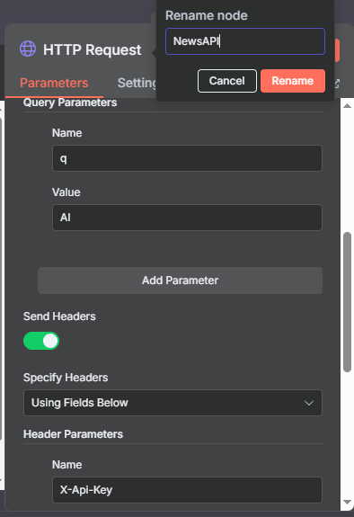

# N8N Daily News
- Scheduled to send you daily news at 10 AM through Telegram.
- You can check it out by importing `News_Summarizer.json` into n8n.

## Output

- It has successfully generated a summary of the news and sent it to my Telegram through a Telegram Bot.

## Nodes

- Trigger
    - Schedule Trigger
- Http Request Nodes
    - Based on the number of sources you want to consume news from.
    - Attach in parallel next to the trigger node to fetch news from each source.
- AI Agent
- Telegram

## Steps
- Create a trigger node.

    

- Attach a number of Http Request nodes in parallel to fetch news from each source.

    

- Go to `GNews Api`, [sign up](https://gnews.io/register), and read the documentation to understand the parameters you want to configure like keywords, language...

    

- Use one of the Http Request nodes to fetch news from GNews Api by pasting the Get Request url from GNews Api and adding the parameters like q, apikey...

    

    

- Test the node

    

- Go to `News Api`, sign up, and read the documentation to understand the parameters you want to configure like keywords, language, sort by, page size...

    

- Use one of the Http Request nodes to fetch news from News Api by pasting the Get Request url from News Api and adding the parameters and `X-Api-Key` header for authentication.

    

- Test the node.

    

- Convert the array output of the API responses into string so that the AI Agent can ingest it.

    

- Combine the string outputs of all your sources with the merge node.

    

- Attach an AI Agent after the Merge node with a prompt to generate a summary of the news.

    

- Test node

    

- Create a telegram bot and type `@get_id_bot` without sending it. When popup appears, choose `Your Chat ID`.

    

- Copy your `chat id` and use it in a Telegram node after the AI Agent node for Sending messages.

    

    - Choose Markdown as parse mode.

    

## Contact
 - LinkedIn: [Natan Asrat](https://linkedin.com/in/natan-asrat)
 - Gmail: nathanyilmaasrat@gmail.com
 - Telegram: [Natan Asrat](https://t.me/fail_your_way_to_success)
 - Youtube: [Natville](https://www.youtube.com/@natvilletutor)